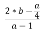

# Лабораторная работа №2. Арифметические команды (Вариант №25)

**Цель работы:** изучение арифметических команд и получение навыка работы с ними.

## **Постановка задачи**
Занести числа в память \
&nbsp; a = 5'678'901; \
&nbsp; b = 6'789'012; \
&nbsp; c = 7'890'123; \
&nbsp; d = 8'901'234; \
&nbsp; e = 9'012'345; \
&nbsp; f =10'123'456.

Произвести операции над числами a,b,c,d,e,f  по вариантам, заданным в таблице. Результат вывести в память и распечатать в Memo.

|Номер варианта|Выражение|
|:-:|:-:|
|25||


## **Код программы**
```c
#include<iostream>
#include<conio.h>
#include<iomanip>
#include<sstream>

using namespace std;
const int DataSize = 144;

string IntToHex(int n)
{
	stringstream ss;
	ss << hex << n;
	return ss.str();
}

// 1)
//	2*b - (a/4) = num1
//	 1  3   2

// 2)
//	a - 1 = num2

// 3)
// num1/num2 = num3

int main()
{
	int32_t a = 5678901; // 0x56A735
	int32_t b = 6789012; // 0x679794
	int32_t c = 7890123; // 0x7864CB
	int32_t d = 8901234; // 0x87D272
	int32_t e = 9012345; // 0x898479
	int32_t f = 10123456; // 0x9A78C0

	unsigned char Memo[DataSize];
	for (int i = 0; i < DataSize; i++) {
		Memo[i] = NULL;
	}

	__asm {
		PUSHAD

		LEA EDI, Memo // Храним в регистре EDI адресс первого байта Memo

		// 1)-1
		MOV EAX, b
		MOV EBX, 2
		MUL EBX
		MOV DWord Ptr [EDI], EAX
		MOV DWord Ptr [EDI + 4], EDX

		// 1)-2
		MOV EAX, a
		xor EDX, EDX
		MOV EBX, 4
		DIV EBX
		MOV EBX, EAX
		MOV ECX, 0

		// 1)-3
		MOV EAX, DWord Ptr [EDI]
		MOV EDX, DWord Ptr [EDI + 4]
		SUB EAX, EBX
		SBB EDX, ECX
		MOV DWord Ptr [EDI], EAX
		MOV DWord Ptr [EDI + 4], EDX

		// 2)
		MOV EAX, a
		SUB EAX, 1
		MOV EBX, EAX

		// 3)
		MOV EAX, DWord Ptr [EDI]
		MOV EDX, DWord Ptr [EDI + 4]
		DIV EBX
		MOV DWord Ptr [EDI], EAX

		POPAD
	}

	for (int i = 0; i < DataSize; i++) {
		if ((i % 16) == 0) {
			cout << "\n" << setw(2) << i / 16 << ":";
		}
		else {
			cout << " " << setw(2) << IntToHex(Memo[i - 1]);
		}
	}
	_getch();

	return 0;
}

```

## **Вывод**
1.	В ходе выполнения лабораторной работы были изучены основные арифметические команды языка ассемблера, такие как ADD, SUB, MUL, DIV.
2.	Было продемонстрированно вычисление большой дроби с использованием этих команд, а также работа с числами большей разрядности, чем 32-bit.
3.	Выяснили, что при работе с большими числами требуется учитывать размер данных и ограничения регистров процессора.
4.	Показали, как при вычислении большого числа команды математических операций могу действовать вместе (например, ADD и ADC для учета знака числа и переноса битов из младшей части в старшую и наоборот.

## **Заключение**
Выполнение лабораторной работы расширило знание команд языка ассемблера. Мы убедились, что правильное применение этих инструкций требует учета особенностей работы с регистрами. Полученные навыки будут необходимы при разработке любых вычислительных программ. 