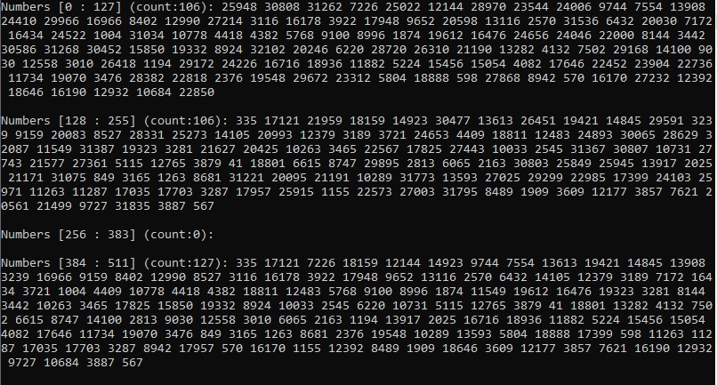

# Лабораторная работа №3. Команды передачи управления (Вариант №25)

**Цель работы:** изучение команд передачи управления и получение навыка работы с ними.

## **Постановка задачи**
1.	С помощью процедуры Random сформировать случайное целое число в диапазоне от 0 до 65535;
2.	Четное число (четное с точки зрения математики) записать в ЯП (ячейку памяти), начиная с нулевого элемента массива data. Нечетное число (нечетное с точки зрения математики) записать в ЯП, начиная с 128 элемента массива data. Все числа, которые больше или равны 50000 записать в ЯП, начиная с 256 элемента массива data. Все числа, которые меньше 10000 записать в ЯП, начиная с 384 элемента массива data;
3.	Повторять п.1-п.2, пока число распределенных данных по любому из признаков не превысит 127.

## **Код программы**
```c
#include<iostream>
#include<ctime>

using namespace std;
const int DataSize = 512;

int main()
{
    srand(time(NULL));

    unsigned short data[DataSize] = { NULL };

    int32_t even_counter = 0;
    int32_t odd_counter = 0;
    int32_t more_50000_counter = 0;
    int32_t less_10000_counter = 0;

    _asm {
        PUSHAD

        main_loop :
            CALL rand
            MOV ESI, EAX
            MOV EBX, 2 
            xor EDX, EDX
            DIV EBX
            CMP EDX, 0
            JE even_num_proc
            JNE odd_num_proc
            JMP main_loop_exit

        even_num_proc :
            MOV ECX, 0
            LEA EBX, even_counter
            MOV EDX, DWord Ptr[EBX]
            CALL add_num_in_data
            CALL inc_counter_proc
            JMP more_or_less_proc

        odd_num_proc :
            MOV ECX, 128
            LEA EBX, odd_counter
            MOV EDX, DWord Ptr[EBX]
            CALL add_num_in_data
            CALL inc_counter_proc
            JMP more_or_less_proc

        more_or_less_proc :
            CMP EAX, 50000
            JAE more_50000_proc
            CMP EAX, 10000
            JBE less_10000_proc
            JMP couters_reach_127_proc

        more_50000_proc :
            MOV ECX, 256
            LEA EBX, more_50000_counter
            MOV EDX, DWord Ptr[EBX]
            CALL add_num_in_data
            CALL inc_counter_proc
            JMP couters_reach_127_proc


        less_10000_proc :
            MOV ECX, 384
            LEA EBX, less_10000_counter
            MOV EDX, DWord Ptr[EBX]
            CALL add_num_in_data
            CALL inc_counter_proc
            JMP couters_reach_127_proc

        add_num_in_data
            ADD ECX, EDX
            LEA EDI, data
            MOV Word Ptr[EDI + ECX * 2], SI
            RET

        inc_counter_proc :
            INC EDX
            MOV DWord Ptr[EBX], EDX
            RET

        couters_reach_127_proc :
            LEA EBX, even_counter
            CALL current_counter_reach_127_proc
            JAE main_loop_exit

            LEA EBX, odd_counter
            CALL current_counter_reach_127_proc
            JAE main_loop_exit

            LEA EBX, more_50000_counter
            CALL current_counter_reach_127_proc
            JAE main_loop_exit

            LEA EBX, less_10000_counter
            CALL current_counter_reach_127_proc
            JAE main_loop_exit

            JMP main_loop


        current_counter_reach_127_proc :
            MOV EDX, DWord Ptr[EBX]
            CMP EDX, 127
            RET


        main_loop_exit :

        POPAD
    }

    int i = 0, j = i + even_counter;
    cout << "Numbers [0 : 127] (count:" << even_counter << "): ";
    for (i; i < j; i++) {
        cout << data[i] << " ";
    }
    cout << "\n" << endl;

    i = 128, j = i + odd_counter;
    cout << "Numbers [128 : 255] (count:" << odd_counter << "): ";
    for (i; i < j; i++) {
        cout << data[i] << " ";
    }
    cout << "\n" << endl;


    i = 256, j = i + more_50000_counter;
    cout << "Numbers [256 : 383] (count:" << more_50000_counter << "): ";
    for (i; i < j; i++) {
        cout << data[i] << " ";
    }
    cout << "\n" << endl;

    i = 384, j = i + less_10000_counter;
    cout << "Numbers [384 : 511] (count:" << less_10000_counter << "): ";
    for (i; i < j; i++) {
        cout << data[i] << " ";
    }
    cout << "\n" << endl;

    return 0;
}
```



## **Вывод**
1.	В ходе выполнения лабораторной работы были изучены команды передачи управления языка ассемблера, такие как JMP, JCC, CALL, RET.
2.	Были изучены команды CMP, CMPXCHG и CMPXCHG8B для сравнения данных между собой.
3.	Также была изучена группа команд LOOP, которые позволяют создавать циклы со счетчиком.
4.	Было продемонстрированно как с помощью команд передачи управления можно реализовать циклы, а с помощью связки команд CMP и JCC реализовать функционал, похожий на условные операторы в языках более высокого уровня.
5.	Выяснили, что при работе командой CALL требуется обязательно использовать в конце команду RET, так как при ее отсутствии в регистре EPI будут храниться невалидные данные.

## **Заключение**
Выполнение лабораторной работы расширило знание команд языка ассемблера. Мы реализовали конструкции такие, как циклы и условные переходы, необходимые для построения более сложных программ. Также научились выделять повторяющиеся части кода в отдельные процедуры и переиспользовать их. Полученные навыки будут необходимы при разработке программ со сложной логикой и ветвлением.